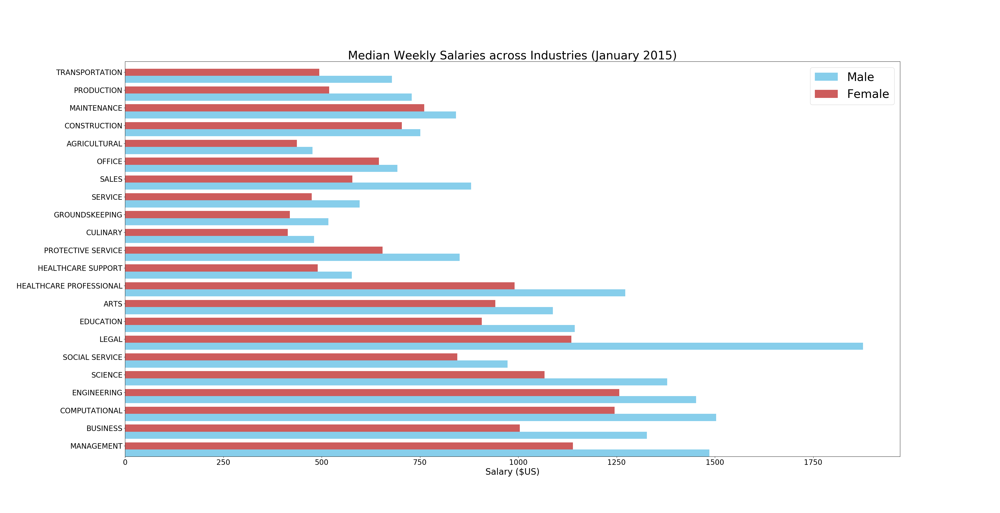
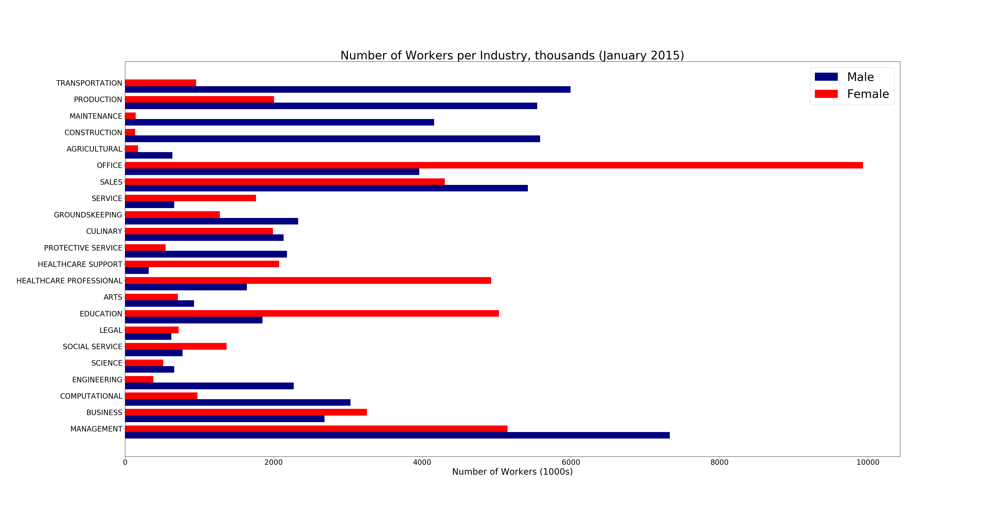
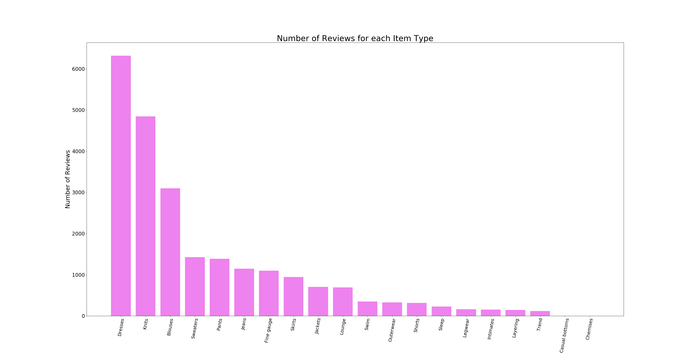

# ruminations
Analysis of datasets. Practice in Python and R.

## About
A repository where I do data analysis stuff on various datasets. 
Each subdirectory will contain a different dataset / script that processes that dataset. 
All results will be displayed here for now. 

## Results
### U.S. Incomes by Occupation and Gender
Uses the following dataset:
https://www.kaggle.com/jonavery/incomes-by-career-and-gender

Here is a plot showing weekly median salaries for both men and women across all industries:

And here is a plot showing the number of men and women in all industires:

What can be said about the data?
Well for sure, men earn more than women in almost all industries.
Men outnumber women in certain industries such as Engineering, Construction, and Maintenance.
Women outnumber men in industries like Office, Healthcare, and Education.

Now, as the dataset does not contain any other contextual data (eg. years of experience, position, etc.), it is unfair to conclude any more than what this above data shows.

### Women's Ecommerce Clothing Reviews
Uses this dataset:
https://www.kaggle.com/monkey09/women-e-clothing-reviews

What are the most commonly reviewed item classes from the dataset?

### Mental Health in Tech
Dataset: https://www.kaggle.com/osmi/mental-health-in-tech-survey

