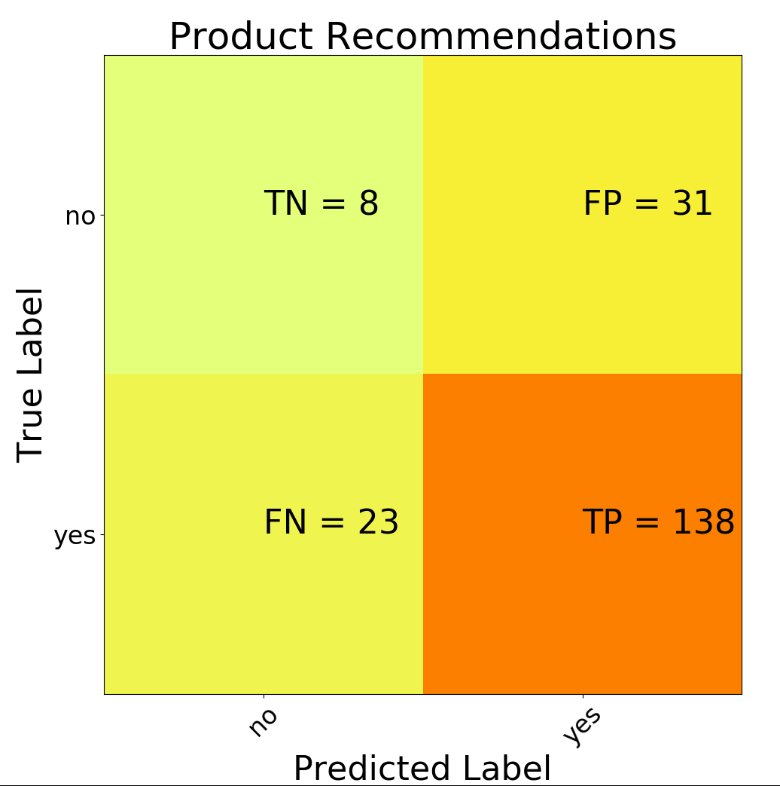

# ruminations
Analysis of datasets. Practice in Python and R.

## About
A repository where I do data analysis stuff on various datasets. 
Each subdirectory will contain a different dataset / script that processes that dataset. 
All results will be displayed here for now. 

# Results
## U.S. Incomes by Occupation and Gender
Uses the following dataset:
https://www.kaggle.com/jonavery/incomes-by-career-and-gender

Here is a plot showing weekly median salaries for both men and women across all industries:


And here is a plot showing the number of men and women in all industires:


What can be said about the data?
Well for sure, men earn more than women in almost all industries.
Men outnumber women in certain industries such as Engineering, Construction, and Maintenance.
Women outnumber men in industries like Office, Healthcare, and Education.

Now, as the dataset does not contain any other contextual data (eg. years of experience, position, etc.), it is difficult to conclude any more than what this above data shows.


## Women's Ecommerce Clothing Reviews
Uses this dataset:
https://www.kaggle.com/monkey09/women-e-clothing-reviews

What are the most commonly reviewed item classes from the dataset?


Perhaps unsurprisingly, `Dresses` is the most reviewed item.

Next, I try my hand at some NLP. I'm following my notes from the Udemy course I'm doing.
First, I take the review texts of the first 1000 reviews (I don't take all of them, since it takes really long
for this method to process all the comments), and I clean them up - stemming, remove punctuation, etc.
Then, I fit a Bag-of-words model, and then fit a classifier to the resulting
document-term matrix. Now I have an array of 1000 cleaned strings, and then we split this array
into a test and training set. A confusion matrix is generated for the test set performance.



Our accuracy is pretty good, but there is a problem.
Although we successfully predict cases where the product is recommended,
we don't predict cases where the product is not recommended.

Let's try again, but with 5000 reviews.


Oof. that's not any better. Perhaps review text is not a good predictor for whether the reviewer recommend the product.

## Mental Health in Tech
Dataset: https://www.kaggle.com/osmi/mental-health-in-tech-survey

First, let's get a feel for what the data looks like. Plot of age and genders:


There were a couple of entries for gender that I classified as "other", and the list of these in the dataset were:
```
male-ish
maile
trans-female
cis female
something kinda male?
mal
queer/she/they
non-binary
nah
all
enby
fluid
genderqueer
androgyne
agender
cis-female/femme
guy (-ish) ^_^
male leaning androgynous
trans woman
neuter
female (trans)
queer
mail
a little about you
female (trans)
p
femail
ostensibly male, unsure what that really means
```
My logic for this was to correct typos (such as "malr"), and then for everything else, I classify as other.
For instance, "queer" is not a gender, so I would just go ahead and classify this as "other".

Now, let's look at some of the categorical data from the dataset:

Family History: "Yes" indicates that there is a family history of mental illness.
```
| family_history   |   count |
|------------------+---------|
| No               |     767 |
| Yes              |     492 |
```

Treatment: "Yes" indicates having sought out treatment for a mental health condition.
```
| treatment   |   count |
|-------------+---------|
| No          |     622 |
| Yes         |     637 |
```

Work Interference: For those who have a mental health condition, how do people feel like their work gets affected?
```
| work_interfere   |   count |
|------------------+---------|
| Never            |     213 |
| Often            |     144 |
| Rarely           |     173 |
| Sometimes        |     465 |
```

Remote Work: "Yes" indicates work from home more than 50% of the time.
```
| remote_work   |   count |
|---------------+---------|
| No            |     883 |
| Yes           |     376 |
```

Benefits: Does the employer provide mental health benefits?
```
| benefits   |   count |
|------------+---------|
| Don't know |     408 |
| No         |     374 |
| Yes        |     477 |
```

Care Options: Do individuals know how to seek out care options from the employer?
```
| care_options   |   count |
|----------------+---------|
| No             |     501 |
| Not sure       |     314 |
| Yes            |     444 |
```

Seeking Help: Does the employer provide resources for mental health issues?
```
| seek_help   |   count |
|-------------+---------|
| Don't know  |     363 |
| No          |     646 |
| Yes         |     250 |
```

Consequences for bringing up mental health: Do you think bringing up mental health issues would have a negative impact on your employment?
```
| mental_health_consequence   |   count |
|-----------------------------+---------|
| Maybe                       |     477 |
| No                          |     490 |
| Yes                         |     292 |
```

Consequences for bringing up physical health: Do you think bringing up physical health issues would have a negative impact on your employment?
```
| phys_health_consequence   |   count |
|---------------------------+---------|
| Maybe                     |     273 |
| No                        |     925 |
| Yes                       |      61 |
```


### Comment Wordclouds
Next, I look at the comments provided, and generate wordcloud visualizations for all the comments.


I've removed all the stopwords (provided from the WordCloud library), and I added my own stopwords,
which I feel are words that are not very helpful:
`["employer", "employee", "employed", "company", "mental", "health", "issues", "work", "people", "know", "questions"]`

Notably, words like `depression`, `insurance`, and `anxiety` appear quite often.


